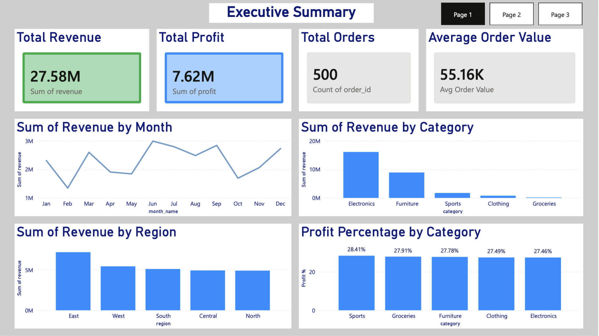
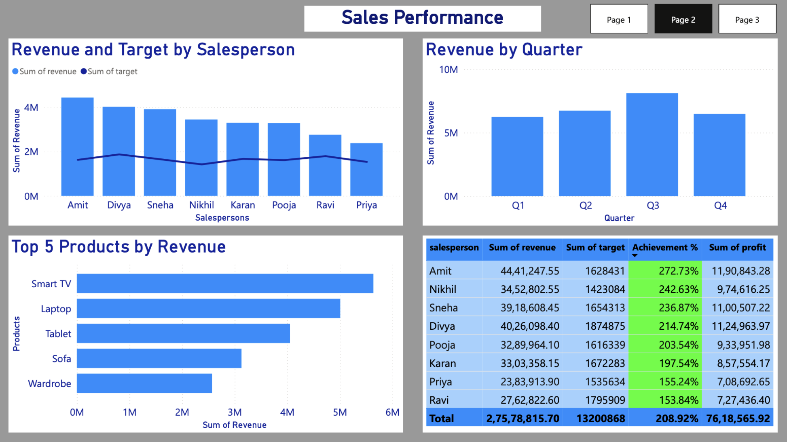
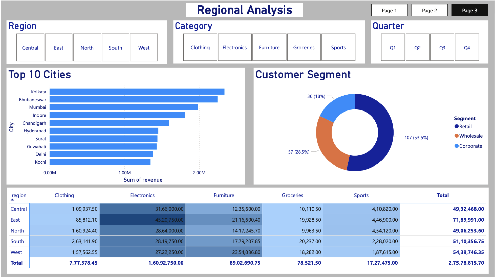

# 📊 India Sales Performance Dashboard — Power BI


## 📌 Project Overview

An interactive 3-page Sales Performance Dashboard built in Power BI, analyzing 500 sales transactions across 5 regions, 8 salespersons, and 5 product categories in India.

---

## 🎯 Business Problem

> Management had no visibility into sales performance across regions, categories, and salespersons. Decisions were being made on gut feeling rather than data.

**Before this dashboard:**
- ❌ Sales data scattered across Excel files
- ❌ No way to track salesperson vs target
- ❌ Regional comparison not possible
- ❌ Monthly reports took 2 days manually

**After this dashboard:**
- ✅ Real-time sales overview in one screen
- ✅ Instant salesperson vs target comparison
- ✅ Regional performance at a glance
- ✅ Reports generated in 0 seconds

---

## 📁 Project Structure

```
sales-dashboard-powerbi/
│
├── 📁 data/
│   ├── sales_transactions.csv   # 500 rows — main fact table
│   ├── sales_targets.csv        # 96 rows — monthly targets
│   └── customers.csv            # 200 rows — customer segments
│
├── 📁 dashboard/
│   └── Sales_Dashboard.pbix     # Power BI dashboard file
│
├── 📁 screenshots/
│   ├── page1_executive.png      # Executive Summary
│   ├── page2_sales.png          # Sales Performance
│   └── page3_regional.png       # Regional Analysis
│
└── 📄 README.md
```

---

## 🗄️ Data Model

```
┌─────────────────┐         ┌──────────────────────────┐
│   customers     │         │    sales_transactions    │
│─────────────────│         │──────────────────────────│
│ customer_id     │         │ order_id  (PK)           │
│ name            │────────▶│ date, month, quarter     │
│ city            │         │ region, city             │
│ region          │         │ category, product        │
│ segment         │         │ salesperson              │
└─────────────────┘         │ quantity, unit_price     │
                            │ discount_pct             │
┌─────────────────┐         │ revenue, profit          │
│  sales_targets  │         └──────────────────────────┘
│─────────────────│                    │
│ salesperson     │◀───────────────────┘
│ month           │
│ target          │
└─────────────────┘
```

---

## 📐 DAX Measures

```dax
Total Revenue    = SUM(sales_transactions[revenue])
Total Profit     = SUM(sales_transactions[profit])
Total Orders     = COUNT(sales_transactions[order_id])
Avg Order Value  = DIVIDE([Total Revenue], [Total Orders])
Profit Margin %  = DIVIDE([Total Profit], [Total Revenue]) * 100
Total Target     = SUM(sales_targets[target])
Achievement %    = DIVIDE([Total Revenue], [Total Target]) * 100
```

---

## 📊 Dashboard Pages

### Page 1 — Executive Summary


**Visuals:**
- 4 KPI Cards — Revenue, Profit, Orders, Avg Order Value
- Line Chart — Monthly Revenue Trend
- Bar Chart — Revenue by Category
- Bar Chart — Revenue by Region
- Bar Chart — Profit % by Category

**Key Insights:**
- 💰 Total Revenue = ₹27.58M
- 📈 Total Profit = ₹7.62M
- 📦 Total Orders = 500
- 🏆 Top Category = Electronics
- 🗺️ Top Region = East
- 📅 Peak Month = July

---

### Page 2 — Sales Performance


**Visuals:**
- Combo Chart — Revenue vs Target by Salesperson
- Bar Chart — Top 5 Products by Revenue
- Column Chart — Revenue by Quarter
- Table — Salesperson Summary with Achievement %

**Key Insights:**
- 🏆 Top Salesperson = Amit (₹44.41L, 272.73% of target)
- 📦 Top Product = Smart TV (₹5M+)
- 📅 Best Quarter = Q3
- 💹 All salespersons exceeded targets (150%+)
- ⚠️ Targets may need revision upward for 2025

---

### Page 3 — Regional Analysis


**Visuals:**
- Matrix — Revenue by Region × Category
- Bar Chart — Top 10 Cities by Revenue
- Donut Chart — Customer Segment Distribution
- Slicers — Region, Category, Quarter (interactive!)

**Key Insights:**
- 🏙️ Top City = Kolkata
- 🗺️ Top Region = East (₹71.89L)
- 👥 Largest Segment = Retail (53.5%)
- 📦 Electronics dominates all regions
- 🔍 Central region has lowest revenue — opportunity!

---

## 🛠️ Tools Used

| Tool | Purpose |
|------|---------|
| Power BI Desktop | Dashboard building |
| Power Query | Data cleaning & transformation |
| DAX | Custom calculations & measures |
| CSV Files | Data source |

---

## 🚀 How to Use

1. Clone this repository
```bash
git clone https://github.com/yourusername/sales-dashboard-powerbi.git
```

2. Open Power BI Desktop

3. Open `dashboard/Sales_Dashboard.pbix`

4. If data doesn't load → click **Transform Data**
   → Update file paths to your local `/data/` folder

5. Click **Refresh** — dashboard loads with full data!

---

## 💡 Key Business Recommendations

Based on the analysis:

1. **Double down on Electronics** — highest revenue category across all regions
2. **Focus on Central region** — lowest revenue, highest growth opportunity
3. **Revise 2025 targets upward** — all salespersons exceeded 150% of target
4. **Invest in Retail segment** — 53.5% of customers, largest opportunity
5. **Q3 promotions work** — highest revenue quarter, replicate strategy

---

## 👩‍💻 Author

**Harshii**
- 🔗 GitHub: [harshi1006](https://github.com/harshi1006)
- 💼 Role: Data Analyst | TCS
- 📍 Indore, India

---

## 📄 License

This project is open source and available under the MIT License.
